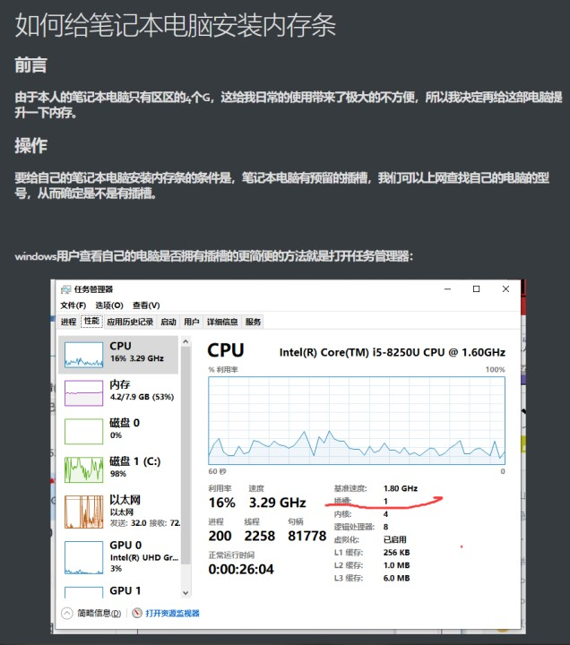
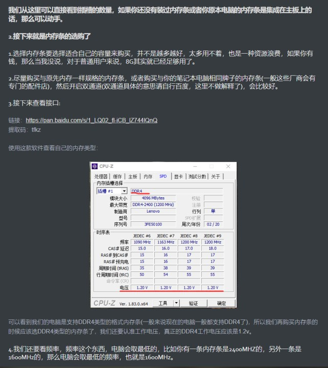
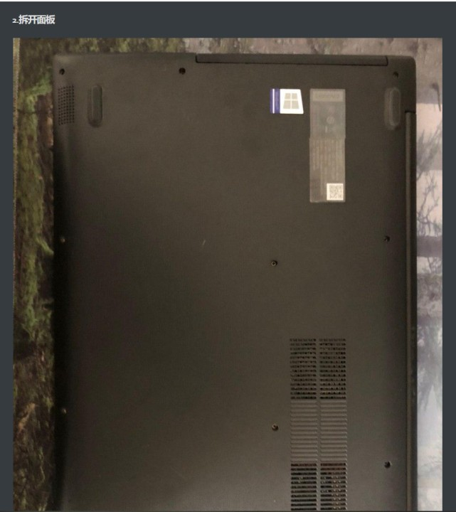
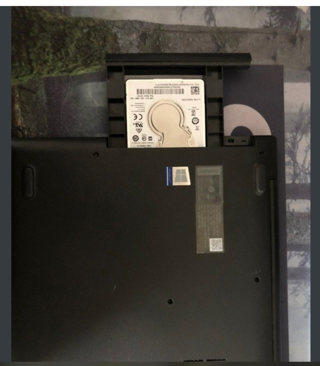
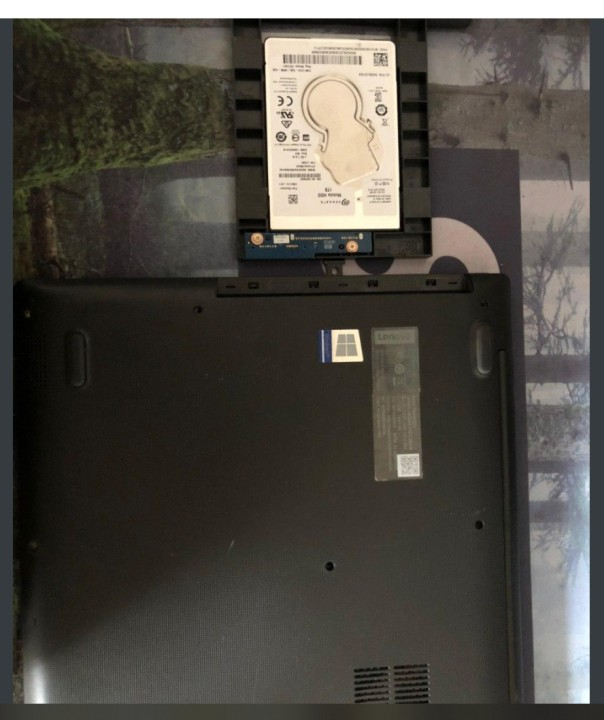
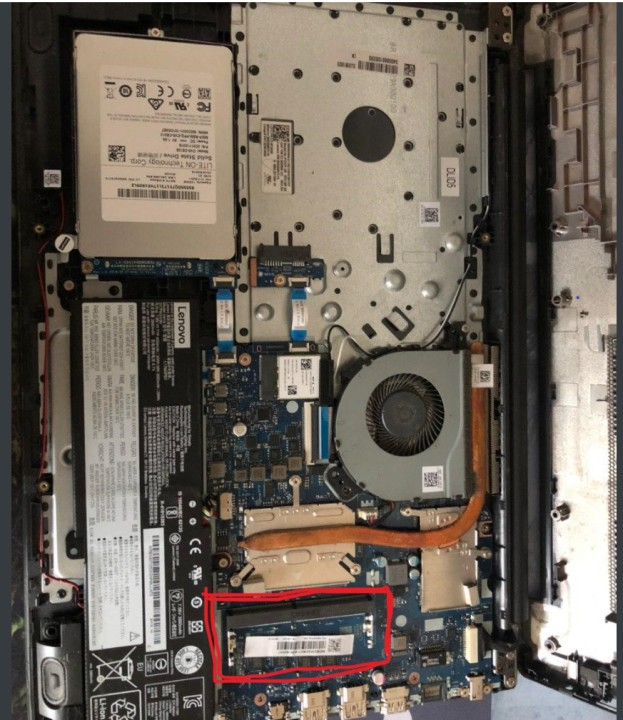
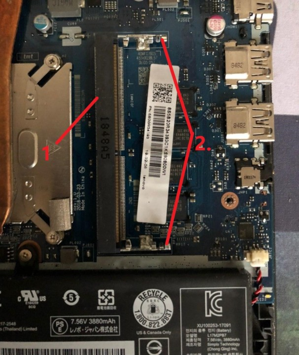
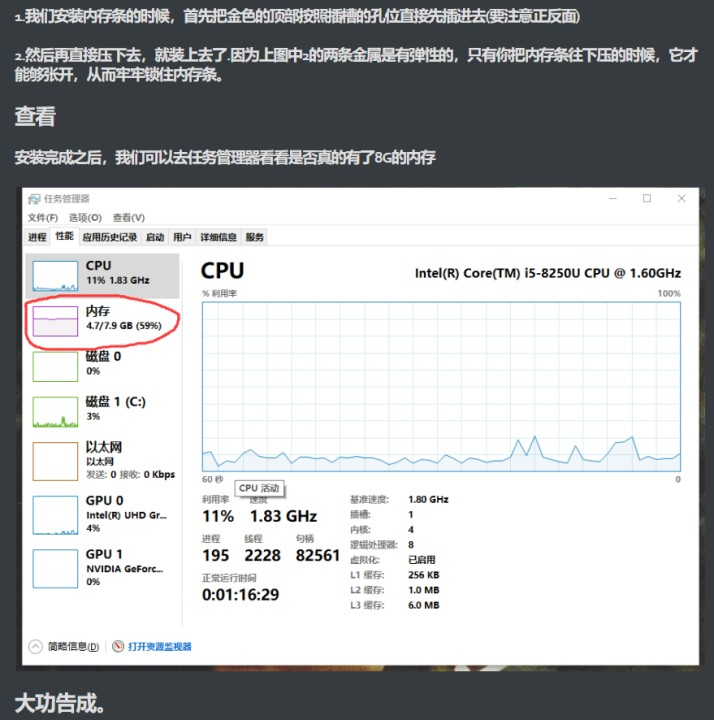

# 如何给笔记本电脑安装内存条

##  前言

### 由于本人的笔记本电脑只有区区的4个G，这给我日常的使用带来了极大的不方便，所以我决定再给这部电脑提升一下内存。

## 操作

### 要给自己的笔记本电脑安装内存条的条件是，笔记本电脑有预留的插槽，我们可以上网查找自己的电脑的型号，从而确定是不是有插槽。

### windows用户查看自己的电脑是否拥有插槽的更简便的方法就是打开任务管理器：

### 我们从这里可以直接看到插槽的数量，如果你还没有装过内存条或者你原本电脑的内存条是集成在主板上的话，那么可以动手。

### 2.接下来就是内存条的选购了

#### 1.选择内存条要选择适合自己的容量来购买，并不是越多越好，太多用不着，也是一种资源浪费，如果你有钱，那么当我没说，对于普通用户来说，8G其实就已经足够用了。

#### 2.尽量购买与原先内存一样规格的内存条，或者购买与你的笔记本电脑相同牌子的内存条(一般这些厂商会有专门的配件店)，然后开启双通道(双通道具体的意思请自行百度，这里不做解释了)，会比较好。

#### 3.接下来查看接口:

链接：https://pan.baidu.com/s/1_LQ02_fl-iCB_lZ744lQnQ 
提取码：tfkz

使用这款软件查看自己的内存类型：

可以看到我们的电脑是支持DDR4类型的格式内存条(一般来说现在的电脑一般都支持DDR4了)，所以我们再购买内存条的时候应该选DDR4类型的内存条了，我们还要认准工作电压，真正的DDR4工作电压应该是1.2v。

#### 4.我们还要看频率，频率这个东西，电脑会取最低的，比如你有一条内存条是2400MHZ的，另外一条是1600MHz的，那么电脑会取最低的频率，也就是1600MHz。

## 准备工作完成之后，我们就可以进行安装了

### 1.我们先请出今天的主角

附上购买链接:https://item.jd.com/100003233680.html

### 2.拆开面板

### 我们先把背板的螺丝都给拧出来，这个就不用教了吧

#### 这个是我的机械硬盘，不用在意，安装完内存条之后，把它插回去就行了

#### 我们来看看拆开后的样子，我要提醒一下的是，因为背板是有卡扣扣住的，所以并不是拧完螺丝后，就可以直接取出来，我们还要把这些卡扣一一解开，这个过程要特别的小心，宁愿慢一点，也不要心急，一定要小心。

#### 我们来看看拆来后的样子

#### 我圈出来的部分就是内存条的插槽，另外我们既然拆开了，我们也可以对我们电脑的内部做一下清洁，我们可以买一个小的那种毛刷扫除主板上的灰尘（不建议湿水!!!）

#### 

### 1.我们安装内存条的时候，首先把金色的顶部按照插槽的孔位直接先插进去(要注意正反面)

### 2.然后再直接压下去，就装上去了.因为上图中2的两条金属是有弹性的，只有你把内存条往下压的时候，它才能够张开，从而牢牢锁住内存条。

## 查看

### 安装完成之后，我们可以去任务管理器看看是否真的有了8G的内存

## 大功告成。

