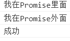
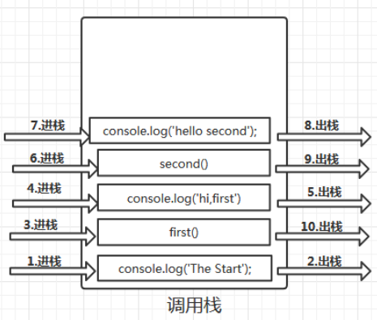
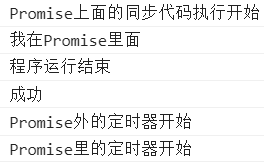
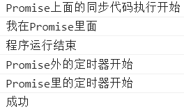

# Event Loop

先看以下代码的执行顺序

```javascript
var promise = new Promise(resolve => {
  console.log("我在Promise里面");
  resolve();
}).then(() => console.log("成功"));
console.log("我在Promise外面");
```

运行结果:



先介绍几个概念:

调用栈：

先看代码

```JavaScript
 const second = function(){
 console.log('hello there');
 }
 const first = function() {
 console.log('hi,first');
 second();
 }
 console.log('The Start');//直接输出就是直接进栈，执行完后 出栈
 first();//方法先进栈，执行完内部程序，最后出栈
 console.log('The End');
```

执行顺序:



栈这个数据结构就是后进先出,当调用函数时,就把函数放入栈内执行里面的程序,程序运行结束时,函数调用就结束了,那么函数就出栈,如果里面又调用函数,就把调用的函数压到这个函数的上面,直到最先进栈的函数里面程序运行结束,如上图

任务队列:

一些异步操作会将回调函数,并不会直接放入调用栈里,而是添加到任务队列中，而且不同的异步操作添加到队列的时间也不一样。

比如:

1. onclick 等异步是当事件触发立即会将回调放到任务队列中。

2. setTimeout 会等到延迟时间到了再把回调放到任务队列中。

3. 像网络请求 ajax 是等到请求完成的时候再把回调放到任务队列中去。

```javascript
setTimeout(() => {
  console.log("我是第一个函数");
}, 1000);
console.log("我是第二个函数");
```

运行结果:


程序运行时,遇到同步的操作直接会放入调用栈里面执行,只有调用栈空了,才会把任务队列的函数放到调用栈里面执行.

Event Loop 机制

Event Loop 可以翻译为事件循环,就是在任务队列里面不断的寻找能放入调用栈里的任务,只要有任务进来就会等到调用栈空的时候把任务放入调用栈里执行,而这个事件循环在浏览器环境下就相当于打开网页,就开始事件循环,直到把网页关闭.Node 环境下,就是 http 服务只要一直开着,就会事件循环,直到把服务关掉.

宏任务与微任务

- 宏任务 常见的有 setTimeout,setInterval,setImmediate
- 微任务 常见的有 Promise.then,Object.observe,MutationObserver(浏览器环境下的),process.nextTick(Node 环境下的)

任务队列里面包含了宏任务队列和微任务队列,根据以上的划分,把宏任务放入宏任务队列,把微任务放入微任务队列,等到调用栈为空时,会优先把微任务放到调用栈里执行,然后再把宏任务放到调用栈里面执行

看一个例子:

```javascript
setTimeout(() => {
  console.log("Promise外的定时器开始");
}, 0);
console.log("Promise上面的同步代码执行开始");
new Promise(resolve => {
  setTimeout(() => {
    console.log("Promise里的定时器开始");
  });
  resolve();
  console.log("我在Promise里面");
}).then(() => console.log("成功"));
console.log("程序运行结束");
```

运行结果:



分析:从上到下,从外到里分析.上面程序里总共有 4 个函数的调用,先把第一个 setTimeout 的回调函数放入宏任务队列,再直接执行同步函数 console.log("Promise 上面的同步代码执行开始"),new Promise 传入的函数是会直接执行的,里面又有一个 setTimeout,就放入宏任务队列,而 resolve()执行的是 Promise.then 里面的回调函数,所以会放入微任务队列里,遇到 console.log("我在 Promise 里面");就直接放入调用栈里执行,然后把最后一个 console.log("程序运行结束")放入调用栈里执行,只要调用栈为空,就把任务队列里的函数拿来调用,而只要微任务队列不为空,就会优先把微任务队列的函数放入调用栈里执行,微任务队列为空,再去宏任务队列把里面的函数放入调用栈里执行

注意:如果在执行宏任务里面的函数时创建了微任务,那么等到宏任务执行完毕之后才会执行微任务

把 resolve 放到 setTimeout 里面,就会影响结果

```js
setTimeout(() => {
  console.log("Promise外的定时器开始");
}, 0);
console.log("Promise上面的同步代码执行开始");
var promise = new Promise(resolve => {
  setTimeout(() => {
    resolve();
    console.log("Promise里的定时器开始");
  }, 0);
  console.log("我在Promise里面");
}).then(() => console.log("成功"));
console.log("程序运行结束");
```

结果:



以下代码就是在宏任务里面创建微任务

```js
setTimeout(() => {
  resolve();
  console.log("Promise里的定时器开始");
}, 0);
```

当同步的函数执行完之后,栈为空,而此时并没有微任务,只有宏任务,那么就开始吧宏任务里的函数放到调用栈里执行,而执行函数的时候发现创建了微任务,那么这个微任务就必须等到宏任务队列为空(里面的回调函数全部执行完),才能执行,因为 Event Loop 机制,只要任务队列不为空,就会再次轮到微任务队列里面.
