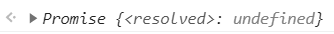

# JS 常见的异步处理

1. callback 回调函数

   ```javascript
   setTimeout(() => {
     console.log("我是第一个函数");
   }, 1000);
   console.log("我是第二个函数");
   ```

   在计时事件里,把函数作为参数传入 setTimeout()函数,并且指定了这个函数执行的条件(在同步的函数调用完 1000ms 之后调用传入的函数),这个函数就叫做回调函数.这就是在 JS 中 callback 的使用

   下面写一个在浏览器环境下异步加载 js 文件的代码

   1. 先在项目的根目录下新建两个 js 文件,取名为 f1.js 和 f2.js

   2. f1.js 里面写上如下代码

      ```javascript
      function f1() {
        console.log("我是第一个函数");
      }
      ```

   3. f2.js 里面写上如下代码

      ```javascript
      function f2() {
        f1(); // 调用了f1.js文件里的函数
        console.log("我是第二个函数");
      }
      ```

   4. 新建一个 html 文件,代码如下

      ```html
      <!DOCTYPE html>
      <html lang="en">
        <head>
          <meta charset="UTF-8" />
          <title>Document</title>
        </head>

        <body>
          <script>
            function load(src, callback) {
              let script = document.createElement("script");
              script.src = src;
              script.onload = callback; // 指定了回调  函数的执行条件,就是在文件读取完毕之后
              document.body.appendChild(script);
            }

            load("f1.js", () => {
              f1();
            });

            load("f2.js", () => {
              f2();
            });
          </script>
        </body>
      </html>
      ```

      然后用浏览器打开,结果如下:

      

      这看上去没什么问题啊,和我们想的一样,我们按照顺序写下来,因为第二个文件里的 js 函数依赖了第一个文件里的 js 函数,我们肯定是要让 f1.js 文件先加载,然后加载 f2.js

      这个时候请按 F5 刷新(多按几次),会出现报错:

      

      这是异步加载时候,我们这么写只决定了给回调函数加执行条件的顺序,真正决定触发回调函数先后顺序的是浏览器,也就是说浏览器先把哪个文件读取好,哪个文件的回调函数就先触发

      为了保证第一个文件先加载完,没办法,我们就必须要把第二个加载函数写到第一个里面,如下

      ```javascript
      load("f1.js", () => {
        f1();
        load("f2.js", () => {
          f2();
        });
      });
      ```

      这样我们保证了第一个回调函数触发之后,才会执行第二个文件的加载,那么就带来了另一个问题,**假设**要读取很多 js 文件,文件之间有很多依赖关系,我们就必须保证加载的顺序,那么我们就要不断的在回调函数里面写加载函数.

      ```javascript
       load("f1.js", () => {
         f1();
         load("f2.js", () => {
           f2();
           load("f3.js", () => {
             f3();
             load("f4.js", () => {
               f4();
               ...
             })
           })
         })
       });
      ```

      像 ajax 异步请求数据的时候也可能会要嵌套,就是想说,有时候为了保证异步操作之间的顺序,要写很多嵌套,一层套一层,这就形成了 Callback Hell(回调地狱).

2. Promise 对象

   Promise 是异步编程的一种解决方案，比传统的解决方案——回调函数和事件——更合理和更强大。它由社区最早提出和实现,ES6 将其写进了语言标准

   下面的代码创造了一个 Promise 实例

   ```javascript
   var promise = new Promise((resolve, reject) => {
     // ...操作
     if (/_ 操作成功 _/) {
       resolve(value);
     } else {
       reject(error);
     }
   });
   ```

   Promise 构造函数接受了一个函数作为参数，该函数的两个参数分别是 resolve 和 reject。它们是两个函数

   - Promise 有三种状态,可以通过 resolve 和 reject 这两个函数修改:

     1. pending: 待定状态

        ```javascript
        new Promise((resolve, reject) => {});
        ```

        

     2. resolved: 成功状态

        ```javascript
        new Promise((resolve, reject) => {
          resolve();
        });
        ```

        

        通过调用 resolve 来改变状态

     3. rejected: 拒绝状态

        ```javascript
        new Promise((resolve, reject) => {
          reject();
        });
        ```

        

        通过 reject 来改变状态,当错误没有处理,Promise 的状态就会是 rejected

   - Promise 的状态一旦修改就无法改变

     ```javascript
     new Promise((resolve, reject) => {
       resolve();
       reject();
     });
     ```

     

     可以看到,Promise 对象的状态被 resolve 修改过,再用 reject 修改就没用了

   - then 方法

     有以下两种写法:

     1. then(success => success)

        ```javascript
        new Promise((resolve, reject) => {
          // ...
          resolve("成功");
        }).then(success => {
          // 进行成功状态下的相关操作
          return success;
        });
        ```

        可以通过 resolve()或 reject()把参数传给 then()里面的函数

     2. then(success => success , error => error)

        ```javascript
        new Promise((resolve, reject) => {
          // 相关操作
          if (/操作成功/) {
            resolve("成功");
          } else {
            reject("失败");
          }
        }).then(
          success => {
            // 进行成功状态下的相关操作
            return success;
          },
          error => {
            // 进行失败状态下的相关操作
            return error;
          }
        );
        ```

        then 里面的第二个参数是选填的,这样写就能处理两种状态
        注意:Promise 实例的 then 方法返回的还是一个 Promise 对象

   - 错误处理与 catch 方法

     上面说到 then 里面的第二个参数是可以省略的,因为可以在 catch 这里处理
     之前的代码可以换一种写法,修改为以下

     ```javascript
     new Promise((resolve, reject) => {
       // 相关操作
       if (/操作成功/) {
         resolve("成功");
       } else {
         reject("失败");
       }
     })
       .then(success => {
         // 进行成功状态下的相关操作
         return success;
       })
       .catch(error => {
         // 进行失败状态下的相关操作
         return error;
       });
     ```

   以下三种都会触发 catch

   ```JavaScript
       reject(new Error("promise fail")) // 直接修改
       throw new Error()
       console.log // 写错误的代码
   ```

   - 取代回调地狱,Promise 的链式调用

     如果 then 方法里面接受的回调函数的返回值是一个 Promise 对象,那么就会执行这个 Promise 构造函数传入的函数,从而达到链式调用

     ```javascript
     new Promise((resolve, reject) => {
       // 相关操作
       if (/操作成功/) {
         resolve("成功");
       } else {
         reject("失败");
       }
     })
       .then(value => {
         // 成功的相应操作
         console.log(value);
         return new Promise((resolve, reject) => {
           // 相关操作
           if (/操作成功/) {
             resolve("成功");
           } else {
             reject("失败");
           }
         });
       })
       .then(value => {
         // 成功的相应操作
         console.log(value);
       })
       .catch(error => {
         // 处理错误的相应操作
         console.log(error);
       });
     ```

     then()里面的回调函数返回的必须是个 Promise,否则第二个 then 处理的还是第一个 Promise,在链式调用的时候,最好把错误进行统一处理,使代码更加清晰

   - Promise.resolve()

     Promise.resolve(value)方法返回一个以给定值解析后的 Promise 对象。如果该值为 Promise 对象,就返回这个 Promise 对象

     ```javascript
     var promise = Promise.resolve(123);
     promise.then(value => console.log(value));
     // 输出123
     ```

     就相当于

     ```javascript
     var promise = new Promise((resolve, reject) => {
       resolve(123);
     });
     promise.then(value => console.log(value));
     // 输出123
     ```

     那么我们就可以简写 之前的 Promise 的链式调用了

     ```javascript
     new Promise((resolve, reject) => {
       // 相关操作
       if (/操作成功/) {
         resolve("成功");
       } else {
         reject("失败");// 这里的reject和下面一样
       }
     })
       .then(value => {
         // 成功的相应操作
         console.log(value);
           if (/操作成功/) {
           return Promise.resolve("成功");
           } else {
             reject("失败");// 这里的reject和上面的一样
           }
         });
       .then(value => {
         // 成功的相应操作
         console.log(value);
       })
       .catch(error => {
         // 处理错误的相应操作
         console.log(error);
       });
     ```

   如果传入的参数是 Promise 对象,就会返回这个对象,如下:

   ```JavaScript
      var promise1 = Promise.resolve(33);
      var promise2 = Promise.resolve(promise1);
      console.log(promise1 === promise2);// true
   ```

3. async/await

   async/await 是 ES8 里面的新定义的处理 异步 目前最优的方案了

   1. async 用法

      async 的本质是使得一个函数返回 Promise 对象

      ```JavaScript
       async function f() {
       }
       f()
      ```

      结果:

      

      返回的是状态为 resolved 的 Promise 对象,如果我们给这个函数返回值

      ```JavaScript
      async function f() {
        return "成功"
      }
      f()
      ```

      结果:

      

      // 可以看到,此时 f 函数有返回值就相当于把这个值传给 Promise.resolve

      ```JavaScript
         Promise.resolve('成功')
      ```

      结果:

      

      async 的错误处理

      ```javascript
      async function test() {
        try {
          throw new Error();
          // 或者console.log; // 写错误的代码
          // 只要出错就会执行error和Promise里一样
        } catch (error) {
          console.log(error);
        }
      }
      test();
      ```

   2. await 用法
      await 只能用在 async 声明的函数里,和返回一个 Promise 对象的函数搭配使用,这个函数返回的 Promise 对象,否则会堵住整个函数内部的代码执行

      ```JavaScript
         function fn(){
            return new Promise(resolve=>{
                // 没有resolve也没有reject
                console.log(1)
            })
        }

        async function f1(){
          await fn();
          console.log(2);
        }
        f1();
        console.log(3);
        // 输出:1 3,因为fn返回的Promise对象处于pending状态,f1函数await下面的代码都执行不了
        // 如果fn()前面没有await,结果为:1 2 3
      ```

      将代码修改为以下:

      ```JavaScript
         function fn(){
            return new Promise(resolve=>{
                resolve("成功");// resolve改变promise的状态
                console.log(1)
            }).then(value => value)
        }

        async function f1(){
          var res = await fn();
          console.log(res)
          console.log(2);
        }
        f1();
        console.log(3);
        // 输出:1 3 成功 2
      ```

   await 需要等到传入 then 方法的函数的返回值,才能让下面的代码执行,所以此时会先执行 f1 函数之外的同步代码

<!-- 4. generator 函数

   [ECMAScript 6 入门](https://es6.ruanyifeng.com/#docs/generator)

5. 订阅/发布(观察者模式-Vue2.x 响应式实现原理)
   To Be Continued

6. 处理异步的框架-RxJS
   To Be Continued -->
